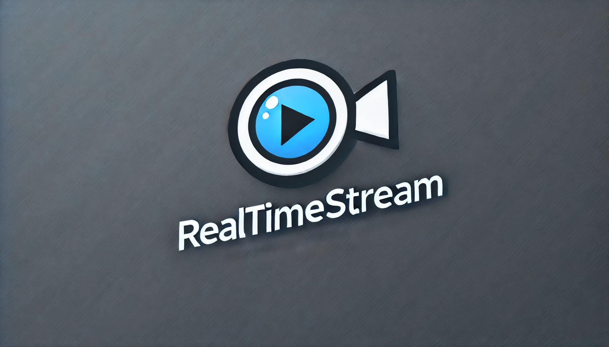
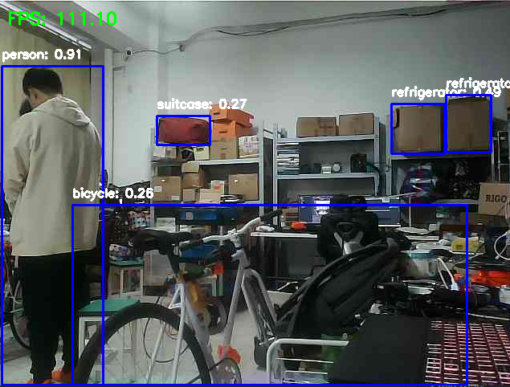

# RealTimeStream



RealTimeStream is a real-time video streaming application that captures video from a camera, serves it via a Flask server, and allows clients to view the live stream. The project is structured to support both host and slave functionalities, enabling efficient video processing and streaming.

## Project Structure

```
📦RealTimeStream
 ┣ 📂model
 ┃ ┣ 📜lane_seg.pt
 ┃ ┗ 📜yolov8s.pt
 ┣ 📂src
 ┃ ┣ 📂host
 ┃ ┃ ┣ 📜flask_video_stream.py
 ┃ ┃ ┗ 📜slave.py
 ┃ ┗ 📂slave
 ┃ ┃ ┣ 📂yolo
 ┃ ┃ ┃ ┗ 📜yolo.py
 ┃ ┃ ┗ 📜video_stream_client.py
 ┣ 📂test
 ┃ ┣ 📜install_gstreamer.sh
 ┃ ┣ 📜test_csi_camera.py
 ┃ ┣ 📜test_usb_camera.py
 ┃ ┗ 📜test_usb_media_dev.py
 ┗ 📜README.md
```

## Features

- **Real-Time Video Streaming**: Capture video from a camera and stream it over the network.
- **Flask Server**: Serve the video stream using a Flask-based server.
- **Client Viewer**: View the live video stream on a client machine.
- **Model Integration**: Incorporate pre-trained models for tasks like lane segmentation and object detection using YOLOv8.

## Prerequisites

- Python 3.8 or higher
- Pip package manager
- Git (optional, for cloning the repository)
- A camera connected to the host machine
- Network connectivity between host and client machines

## Installation

1. **Clone the Repository**

   ```bash
   git clone https://github.com/Ashington258/RealTimeStream
   cd RealTimeStream
   ```

2. **Set Up a Virtual Environment (Optional but Recommended)**

   ```bash
   conda activate -n realtimestream python=3.10  # On Windows: venv\Scripts\activate
   ```

3. **Install Dependencies**

   ```bash
   pip install -r requirements.txt
   ```

4. **Install GStreamer (For Testing)**

   The `test/install_gstreamer.sh` script is provided to install GStreamer dependencies required for testing.

   ```bash
   cd test
   chmod +x install_gstreamer.sh
   ./install_gstreamer.sh
   cd ..
   ```

## Usage

### Running the Flask Video Stream Server (Host)

1. **Navigate to the Host Directory**

   ```bash
   cd src/host
   ```

2. **Run the Slave Server**

   The `slave.py` script starts the Flask server that captures video from the camera and serves it.

   ```bash
   python slave.py
   ```

   The server will start on `http://192.168.2.225:5000/video_feed`.

### Running the Video Stream Client

1. **Navigate to the Slave Directory**

   ```bash
   cd src/slave
   ```

2. **Run the Video Stream Client**

   The `video_stream_client.py` script connects to the Flask server and displays the live video stream.

   ```bash
   python video_stream_client.py
   ```

   A window titled "Received Video Stream" will appear, displaying the live video. Press `q` to quit.

3. go to the web to see the video stream
    http://192.168.2.225:5000/video_feed


4. run the yolo to see



## Testing

The `test` directory contains scripts to test various camera inputs and media devices.

- **Test CSI Camera**

  ```bash
  python test_csi_camera.py
  ```

- **Test USB Camera**

  ```bash
  python test_usb_camera.py
  ```

- **Test USB Media Device**

  ```bash
  python test_usb_media_dev.py
  ```

## Models

The `model` directory contains pre-trained models used for video processing:

- `lane_seg.pt`: Pre-trained model for lane segmentation.
- `yolov8s.pt`: Pre-trained YOLOv8 small model for object detection.

Ensure these models are correctly referenced in your source code for proper functionality.

## Contributing

Contributions are welcome! Please fork the repository and create a pull request with your changes.

## TODO
- [ ] 修改网络模式，网卡改AP模式，不依赖于路由器
- [ ] 笔记本端部署工程
- [ ] 训练集获取
